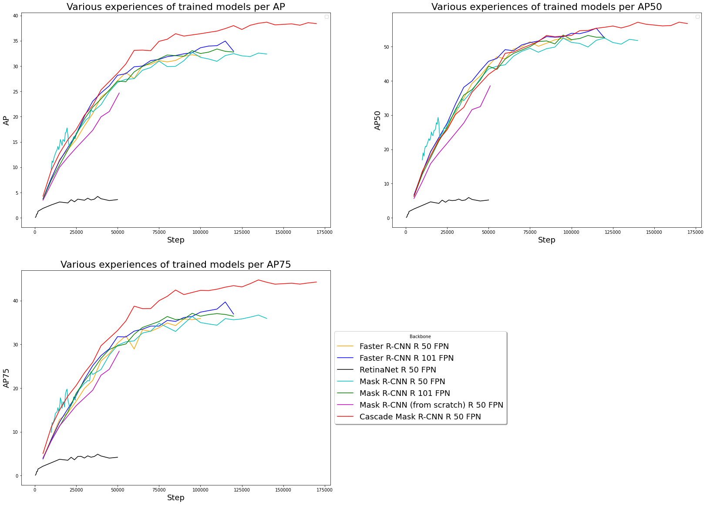
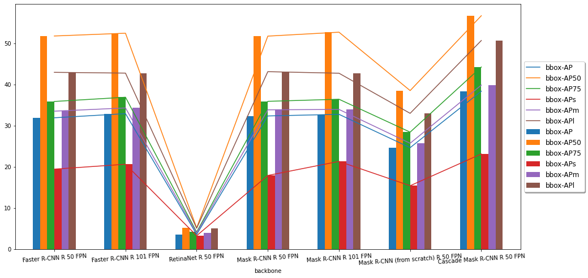
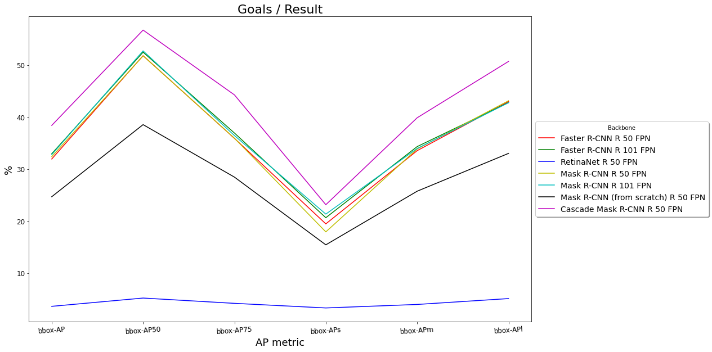

# **Object Detection 👁 with Detectron2** #

> Objects detection and recognition  (brand, logo, shape, etc.) in advertising screens on a TV stream (2M for now).

---

In this notebook we train an object detection model on [QMUL-OpenLogo](https://qmul-openlogo.github.io/index.html) Dataset (Open Logo Detection Challenge). Using Faster R-CNN, RetinaNet, Mask R-CNN and Cascad Mask R-CNN backbone.

(update colab in 2020/06/01. It can execute now. If you get some problem in colab, you may change the environment following the [tutorial of detectron2](https://github.com/facebookresearch/detectron2/blob/master/GETTING_STARTED.md) in colab)

[Detectron2](https://github.com/facebookresearch/Detectron) is a next-generation open-source object detection system powered by Facebook AI research group. With the repo you can use and train the various state-of-the-art models for detection tasks such as bounding-box detection, instance and semantic segmentation, and person keypoint detection.

Under the hood, Detectron2 uses PyTorch (compatible with the latest version(s)) and allows for [blazing fast training](https://detectron2.readthedocs.io/notes/benchmarks.html).
The real power of Detectron2 lies in the HUGE amount of pre-trained models available at the [Model Zoo](https://github.com/facebookresearch/detectron2/blob/master/MODEL_ZOO.md).

## Result / Model Zoo

All numbers were obtained on [Google Colab](https://colab.research.google.com)  with 1 NVIDIA GPU : Tesla P100-PCIE or K80 ... The software in use were PyTorch 1.5, CUDA 10.1, cuDNN 7.6.3.

| Name | backbone | nb iter. for training | Overall training speed | Total training time | AP | AP50 | AP75 | APs | APm | APl | total Loss | inference time (s/im) | Model Size | download |
|:------:|:------:|:------:|:------:|:------:|:------:|:------:|:------:|:------:|:------:|:------:|:------:|:------:|:------:|:------:|
|**Faster R-CNN**| R 50 FPN | 100 000 | s/it | - | 30.8375 | 50.0907 |34.8793 | 18.8721 | 32.7907 | 41.6849 | 0.153 | 0.065018 | 328 Mo | [model](https://drive.google.com/open?id=1-qlpWuYu-JSgc4QMakILqR8JKDIhP7x0) / [metrics](https://drive.google.com/open?id=10W_edHfNh4d5PHau04lRMjWRA5z9Qzjw) |
|**Faster R-CNN**| R 101 FPN | 120 000 | 0.4407 s/it | 20 h 14 min | 34.9535 | 55.3707 | 39.7093 | 21.1202 | 36.5597 | 45.8368 | 0.107 | 0.089403 | 473 Mo | [model](https://drive.google.com/open?id=101kgH7CgI45fRwDE3h32llevphjQNBF9) / [metrics](https://drive.google.com/open?id=11wv9Or300GmFK_SQdIRew8VzMNpYYHH1) |
|**RetinaNet**| R 50 FPN | 50 000 | 0.4340 s/it | 8 h 3 min | 3.6123 | 5.2044 | 4.1868 | 3.3015 | 3.9751 | 5.1046 | 0.221 | 0.092389 | 289 Mo | [model](https://drive.google.com/open?id=1-sNoukPL3qO1XJwAbfTaaiwUo8VapvU_) / [metrics](https://drive.google.com/open?id=1-lkL45q6cgQhdzRkInQZ4ot4HvoKIMiH) |
|**Mask R-CNN**| R 50 FPN | 140 000 | 0.3620 s/it | 27 h 30 min | 32.385 | 51.770 | 35.932 | 17.926 | 33.873 | 43.138 | 0.202 | 0.0723 | 349 Mo |[model](https://drive.google.com/open?id=1-AoHvmGfFS9Akikh6iuslOuBJdnnT_2t) / [metrics](https://drive.google.com/open?id=1-fLv9sVj3d3fNma_fMmNu1V4YivZO6dn)|
|**Mask R-CNN** (from scratch) | R 50 FPN | 51 000 | - | - | 24.6826 | 38.5443 | 28.4530 | 15.4363 | 25.7478 | 33.0177 | 0.342 | - | 360 Mo |[model](https://drive.google.com/open?id=1-6U-mjswmxxh1Se6MO2rvi3AAiMFaXtt) / [metrics](https://drive.google.com/open?id=1-0p6758E6PUvbL1WZw5eKdaoUUL3QVJQ)|
|**Mask R-CNN**| R 101 FPN | 10 000 | 0.4787 s/it | 2 h 19 min | 7.4617 | 12.7215 | 8.0170 | 4.9735 | 7.8142 | 10.5478 | 0.457 | 0.097657 | 831 Mo |[model](https://drive.google.com/file/d/10sS1Q7H0hfoUb-tLSBuk1N0JJ82dysMZ) / [metrics](https://drive.google.com/file/d/10D4_f5Z23vHzFLx0ELLIBiiGxhIn1xyO)|
|**Mask R-CNN**| X 101 32x8d FPN | 5 000 | 3.8520 s/it | 7 h 16 min | 1.7372 | 2.7770 | 1.9930 | 1.1317 | 1.8708 | 2.286  | 0.586 | 0.7615 | 494 Mo |[model](https://drive.google.com/open?id=1-9i4Q2WbR6aW9c2lEmwgoSWDUAQyzA0k) / [metrics](https://drive.google.com/open?id=1-1JIN5bErxsXUsXS5HfibpXzK0vgCn0l)|
|**Cascade Mask R-CNN**|R 50 FPN| 160 000 | 0.4395 s/it | 30 h 1 min | 38.6770 | 57.1028 | 44.2056 | 24.6829 | 40.1366 | 51.3827 | 0.717 | 0.089863 | 556 Mo |[model](https://drive.google.com/open?id=1-CPBMRgYVyieqk9zMdTPeVOKtfU-BF76) / [metrics](https://drive.google.com/open?id=1-Ud1gFlE2nZfV7msZDUSvIucXTu5XQ-O)|

---

# Resources

| Name | Tags | Link | Comment |
|:----:|:----:|:----:|:-------:|
|R-FCN: Object Detection via Region-based Fully Convolutional Networks|`paper`| https://arxiv.org/abs/1605.06409| Jifeng Dai, Yi Li, Kaiming He, and Jian Sun. Conference on Neural Information Processing Systems (NIPS), 2016.|
|Fast R-CNN|`paper`|https://arxiv.org/abs/1504.08083||
|Faster R-CNN: Towards Real-Time Object Detection with Region Proposal Networks|`paper`|https://arxiv.org/abs/1506.01497| Shaoqing Ren, Kaiming He, Ross Girshick, and Jian Sun. Conference on Neural Information Processing Systems (NIPS), 2015.|
|RetinaNet|`paper`|https://arxiv.org/abs/1708.02002| Best Student Paper Award at ICCV 2017|
|Mask R-CNN |`paper`|https://arxiv.org/abs/1703.06870| Kaiming He, Georgia Gkioxari, Piotr Dollár, and Ross Girshick. IEEE International Conference on Computer Vision (ICCV), 2017. |
|Mask RCNN Project|`code` `tools` `example`|https://github.com/matterport/Mask_RCNN| The official implementation of the paper in tensorflow and keras |
|RPN|`paper` | https://arxiv.org/abs/1506.01497 ||
|Feature Pyramid Networks for Object Detection (FPN)|`paper`|https://arxiv.org/abs/1612.03144| Tsung-Yi Lin, Piotr Dollár, Ross Girshick, Kaiming He, Bharath Hariharan, and Serge Belongie. IEEE Conference on Computer Vision and Pattern Recognition (CVPR), 2017.|
|Object Detection|`paper` `code`|https://paperswithcode.com/task/object-recognition||
| Computer Vision |`paper` `code`|https://paperswithcode.com/area/computer-vision/object-detection||
|The 5 Computer Vision Techniques That Will Change How You See The World|`blog post`|https://heartbeat.fritz.ai/the-5-computer-vision-techniques-that-will-change-how-you-see-the-world-1ee19334354b|
|Review of Deep Learning Algorithms for Object Detection|`blog post`|https://medium.com/zylapp/review-of-deep-learning-algorithms-for-object-detection-c1f3d437b852||
||
|COCO dataset|`data`|http://cocodataset.org|Common Objects in COntext|
|QMUL-OpenLogo: Open Logo Detection Challenge|`data`|https://qmul-openlogo.github.io/index.html| QMUL-OpenLogo contains 27,083 images from 352 logo classes, built by aggregating and refining 7 existing datasets and establishing an open logo detection evaluation protocol. Total size: 4.7 GB|
|WebLogo-2M Dataset|`data`|http://www.eecs.qmul.ac.uk/%7Ehs308/WebLogo-2M.html/| The dataset was constructed automatically by sampling the Twitter stream data. It contains 194 unique logo classes and over 2 million logo images. Total size: 178.1 GB |
|VGG Image Annotator|`labelling`|http://www.robots.ox.ac.uk/~vgg/software/via/| Its a simple tool for labeling the images and it labels all the images and exports it to a single JSON file. |
|Labelme|`labelling`| http://labelme2.csail.mit.edu/ | One of the best known tools. The user interface was a bit too slow, however, especially when zooming in on large images.|
|Labelbox|`labelling`|https://www.labelbox.io/|Fairly good for large labeling projects and with options for different types of labeling tasks.|
|COCO UI|`labelling`|https://github.com/tylin/coco-ui|The tool used to rate the COCO dataset.|
|mAP (mean Average Precision) for Object Detection|`blog post`|https://medium.com/@jonathan_hui/map-mean-average-precision-for-object-detection-45c121a31173||
|How do I use Google Drive with Google Colab|`blog post` `tutorial`|https://medium.com/@prajwal.prashanth22/google-colab-drive-as-persistent-storage-for-long-training-runs-cb82bc1d5b71||
|Detectron2: A PyTorch-based modular object detection library|`blog post`|https://ai.facebook.com/blog/-detectron2-a-pytorch-based-modular-object-detection-library-|Official blog of Facebook AI Research (FAIR)|
|Detectron2 GitHub|`code` `tools`|https://github.com/facebookresearch/detectron2|The bees knees of object detection. This will probably form the basis of the project code.|
|How to make a custom dataset in Detectron2|`code` `data` `tutorial`|https://detectron2.readthedocs.io/tutorials/datasets.html|Since I'll want to be bringing my own data and use it with detectron2, I'll probably have to create a custom dataset.|
| Detectron2 example Colab Notebook | `code` `example`| https://colab.research.google.com/drive/16jcaJoc6bCFAQ96jDe2HwtXj7BMD_-m5 | Working example notebook with detectron2, should be used as a baseline for getting custom data to work.|
|Documentation for Detectron2 config useage|`documentation`|https://detectron2.readthedocs.io/modules/config.html#config-references | Goes through a list of the config files in Detectron2.|
|Rethinking ImageNet Pre-training|`paper`|https://arxiv.org/abs/1811.08883|Training Detectron2 from scratch (random initialization)|

That’s all folks, thank you for reading!